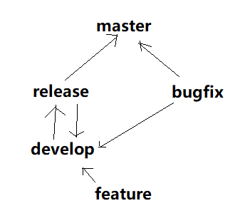

# 配置git

$ git config --global user.name "Your Name"
$ git config --global user.email "email@example.com"

# 生成密钥

```
ssh-keygen -t rsa -C "812747475@qq.com"
cd ~
ls -al
cd .ssh
复制公钥id_rsa.pub到github上
```
# 添加远程仓库,提交到远程仓库
```shell
git remote add origin git@github.com:lafeier888/note.git #创建远程仓库
git push origin master #提交本地master分支到远程仓库origin
```
# 分支管理
```
查看分支：git branch

创建分支：git branch <name>

切换分支：git checkout <name>

创建+切换分支git checkout -b <name>

合并某分支到当前分支：git merge <name>

删除分支：git branch -d <name>
```


git checkout -- file  就是用版本库替换工作区的内容


rm 删除文件,不会自动add到暂存区

git rm 删除文件,自动add到暂存区

git add 添加到暂存区,等待commit

git commit 提交到版本库

git status 查看暂存区状态(和工作区比较)

git diff 比较文件变化

​	1.使用HEAD 比较的是工作区和版本库

​		git diff HEAD -- 22.txt  比较和最新版本的变化

​		HEAD或HEAD~0 最新版本比较

​		HEAD^ 或 HEAD~1最新的上个版本

​		HEAD^^或HEAD~2 最新的上上个版本

​	2.直接使用git diff 比较的是工作区和暂存区

​	3.比较暂存区和版本库的差异

​		git diff --cached

​		git diff --staged

git remote [-v]

git push

git pull 将远程和本地合并


$ mkdir learngit
$ cd learngit
$ pwd
$ git init
ls -ah

$ git add readme.txt
$ git commit -m "wrote a readme file"

$ git status
$ git diff readme.txt 
git log [--pretty=oneline]
HEAD表示当前版本
git reflog
 git reset --hard HEAD^ 回退到上个版本
 git reset --hard 1094a 回退到某个版本


初始化一个本地仓库

git init  

暂存修改

git add *

git add *.java

git add abc.txt

提交到本地仓库

git commit -m 'commit this update'


git remote add xxx_name  xxx_url

git checkout -b xxx_name origin/master

修改...commit

git push own master:master  推送到自己的远端

git pull origin master  跟远端合并同步(防止origin修改了太多)

git push origin master:master  再推送到自己的远端


发个pull request


origin方:

# Git工作流




