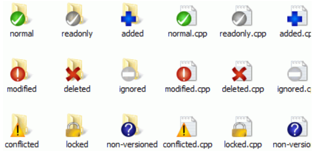

svn就是Subversion

常用的svn客户端有TortoiseSVN

# 图标说明

# 冲突解决

原因:

​	连个人同时编辑的9版本的内容,他先提交的,所以版本库就是10了,而你的本地版本为9,commit的时候就会冲突,因为仓库已经是10,你commit后也是10(自增1),就冲突了,只有你解决冲突,才能提交

1.提交的时候，提示过期,这是会自动提醒你update,之后就会出现冲突

2.更新,提示你冲突

无论哪种,解决的办法都是一样,先update,一旦update之后,自己的版本已经不是9了,变成了10,然后提示你冲突,生成三个文件,工作区的文件也会产生变化

冲突会生成3个文件:

​	mine:你编辑后的文件

​	r9也就是你们两个人都没有编辑之前的文件

​	r10 他编辑后的文件

...如果还有更多人提交,可能还有r11,r12原理都一样

1.用diff工具,解决冲突

<<<<<<< .mine
小兵5
6||||||| .r10
小兵5===
小兵5
7>>>>>>> .r11

<<<<mine

xxxx||||.r10       xx是自己修改的内容  .r10是自己修改完应该升级的版本号

xxx(修改前内容)===  

xxx>>>.r11   最新版本11的内容

修改后标记resolve就行了

2.编辑冲突

黄色是冲突的地方

红色是冲突的内容

比如

内容aa   版本11

内容bb	mine版本

那黄色内容就是:   内容

红色就是

​	内容aa

​	内容bb

修改的时候不要修改黄色的部分,那个是作为参照,是两个版本冲突之前的内容,

修改应该依照红色部分修改,然后标记resolve就行了

