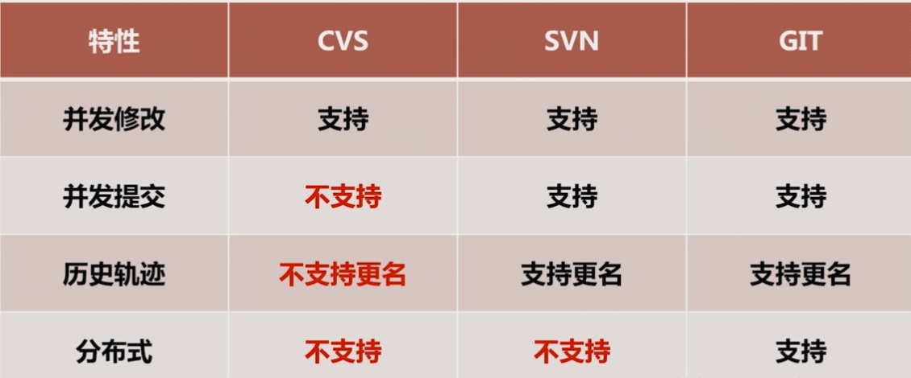

# 术语

**vcs 	版本控制**

**常用**

cvs	集中式

svn	集中式

git	分布式

**不常用**

vss

Subversion 集中式

rcs   本地的,记录文件增量,通过这个可以计算出各个版本的内容

StartTeam

ClearCase

Mercurial 分布式

# 对比

# 疑问

为什么用分布式?

答:这个问题要说到不同工具的对比

svn:集中式,服务器挂了,都不能干活

git是分布式的,就是说有本地仓库和远程仓库,计算没联网,远程仓库挂了,依然可以干活,网络恢复在同步一下仓库就行