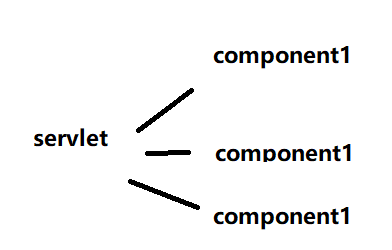

# Spring框架 


spring是个框架,分为几个模块

按照官网的文档分的话:

| [Core](https://docs.spring.io/spring/docs/5.1.2.RELEASE/spring-framework-reference/core.html#spring-core) | IoC container, Events, Resources, i18n, Validation, Data Binding, Type Conversion, SpEL, AOP. |
| ------------------------------------------------------------ | ------------------------------------------------------------ |
| [Testing](https://docs.spring.io/spring/docs/5.1.2.RELEASE/spring-framework-reference/testing.html#testing) | Mock objects, TestContext framework, Spring MVC Test, WebTestClient. |
| [Data Access](https://docs.spring.io/spring/docs/5.1.2.RELEASE/spring-framework-reference/data-access.html#spring-data-tier) | Transactions, DAO support, JDBC, ORM, Marshalling XML.       |
| [Web Servlet](https://docs.spring.io/spring/docs/5.1.2.RELEASE/spring-framework-reference/web.html#spring-web) | **Spring MVC**, WebSocket, SockJS, STOMP messaging.          |
| [Web Reactive](https://docs.spring.io/spring/docs/5.1.2.RELEASE/spring-framework-reference/web-reactive.html#spring-webflux) | Spring WebFlux, WebClient, WebSocket.                        |
| [Integration](https://docs.spring.io/spring/docs/5.1.2.RELEASE/spring-framework-reference/integration.html#spring-integration) | Remoting, JMS, JCA, JMX, Email, Tasks, Scheduling, Cache.    |
| [Languages](https://docs.spring.io/spring/docs/5.1.2.RELEASE/spring-framework-reference/languages.html#languages) | Kotlin, Groovy, Dynamic languages.                           |


## MVC

### 介绍

和其他web框架一样,以 围绕一个中央servlet设计,这个servlet叫做DispatcherServlet,提供请求解析算法,讲实际工作交给可配置的委托组件.


这里设计到一个设计模式:

这是目前大多数的web框架采用的模式,spring mvc也是采用这种设计,只是中央servlet叫做DispatcherServlet

## DispatcherServlet配置

DispatcherServlet需要配置,两种方式

### 1.java配置

```java
public class MyWebApplicationInitializer implements WebApplicationInitializer {

    @Override
    public void onStartup(ServletContext servletCxt) {

        // Load Spring web application configuration
        AnnotationConfigWebApplicationContext ac = new AnnotationConfigWebApplicationContext();
        ac.register(AppConfig.class);
        ac.refresh();

        // Create and register the DispatcherServlet
        DispatcherServlet servlet = new DispatcherServlet(ac);
        ServletRegistration.Dynamic registration = servletCxt.addServlet("app", servlet);
        registration.setLoadOnStartup(1);
        registration.addMapping("/app/*");
    }
}
```

### 2.xml配置

