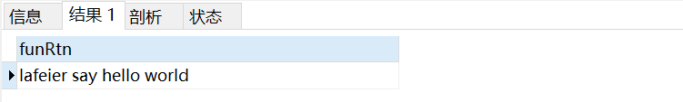

# 导出数据

SELECT * from user    where date='2018-08-30' into OUTFILE 'E:\\1.csv' fields terminated by ',' ;

# 创建临时表

create TEMPORARY table  newTableName as select * from log where id=1;

select @@basedir

select @@datadir


# UDF


```sql
set global log_bin_trust_function_creators=1;-- 开启后才能写函数

DROP FUNCTION IF EXISTS hello;-- 如果函数已经存在,删除

CREATE FUNCTION      -- 创建函数定义
	hello(             -- 函数名
		uname VARCHAR(255),-- 参数
		text VARCHAR(16383) -- 参数
	)
	RETURNS VARCHAR(255)-- 返回值类型声明
BEGIN -- 函数体开始
	
	DECLARE rtn VARCHAR(255);-- 声明一个变量
	set rtn = CONCAT(uname,' say ',text);-- 变量赋值
	RETURN  rtn; -- 函数返回值
END;-- 函数体结束

SELECT  hello('lafeier','hello world') as  funRtn;-- 调用函数
```

